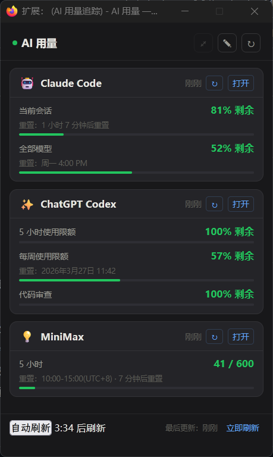

# AI 用量追踪

一个浏览器插件，在 popup 中汇总显示 Claude Code、ChatGPT Codex、MiniMax 三个 AI 工具的用量与限额。



## 功能

- 一键查看三个 AI 工具的用量百分比和重置时间
- 每 5 分钟自动刷新（只 reload 已打开的标签页，不新开）
- 立即刷新按钮 + 30 秒倒计时等待新数据
- 独立浮窗模式（⤢ 按钮）
- 手动编辑数据（✎ 按钮）
- ↻ 按钮绿色 = 对应页面已打开，灰色 = 未打开

## 支持的服务

| 服务 | 需打开的页面 |
|---|---|
| Claude Code | `claude.ai/settings/usage` |
| ChatGPT Codex | `chatgpt.com/codex/settings/usage` |
| MiniMax | `platform.minimaxi.com/user-center/payment/token-plan` |

数据通过读取页面文本自动抓取，无需登录或 API Key。

## 工作原理

- 用 `document.body.innerText` 文本扫描页面，不依赖 CSS selector，兼容 SPA
- 数据仅存储在本地（`browser.storage.local`），不上传至任何服务器
- 无外部网络请求，无追踪

## 安装

### Firefox（推荐）

1. 下载 [最新 Release](../../releases/latest) 中的 `ai-usage-extension-firefox.zip`
2. 打开 `about:debugging` → 「此 Firefox」→「临时载入附加组件」
3. 选择下载的 zip 文件

正式安装（永久）：[Firefox Add-ons 页面](https://addons.mozilla.org)（审核通过后）

### Chrome / Edge

1. 下载 [最新 Release](../../releases/latest) 中的 `ai-usage-extension-chrome.zip`
2. 解压到任意文件夹
3. 打开 `chrome://extensions`（Edge 为 `edge://extensions`）
4. 开启「开发者模式」→「加载已解压的扩展程序」→ 选择解压后的文件夹

> Chrome Web Store 上架审核中。

## 文件结构

```
firefox-src/          # Firefox MV2 版本
  manifest.json
  background.js
  popup.html / popup.js
  content/
    claude.js
    chatgpt.js
    minimax.js
  icons/

chrome-src/           # Chrome / Edge MV3 版本
  manifest.json
  background.js       (service worker)
  popup.html / popup.js
  content/
    claude.js
    chatgpt.js
    minimax.js
  icons/
```

## 隐私说明

本插件：
- **不收集任何个人信息**（无账号名、邮件、Token、Cookie）
- **不向任何外部服务器发送数据**
- 只读取你自己的 AI 工具设置页面上公开显示的用量数字
- 所有数据仅保存在本地浏览器存储中

## License

MIT
